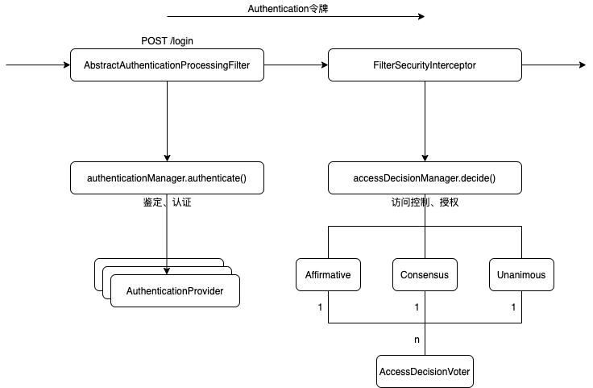

Spring Security 架构
===================

### 如何给系统增加安全

1. Spring Security把安全认证分为两个步骤
    - 鉴定(authentication)
        `Authentication`: 此类相当于令牌,访问者通过携带相关认证信息封装进此类,如UsernamePasswordAuthentication
        封装了用户名和密码.

        `AuthenticationProvider`: 该接口就两个方法
    
        ```Java
        //传入的参数是用户传入的认证信息, 此时的Authencation是未经认证的,
        //根据具体实现对其进行认证后返回, 该方法最终由ProviderManageer调用
        Authentication authenticate(Authentication authentication) throws AuthenticationException
        //根据Filter构造的具体Authentication判断当前鉴定器是否支持
        boolean supports(Class<?> authentication)
        ```

        `ProviderManger`: 该类核心即通过循环调用配置的AuthenticationProvider对用户进行鉴权

        ```Java
        //循环调用配置的AuthenticationProvider
        for (AuthenticationProvider provider : getProviders()) {
            //该AuthenticationProvider是否支持
			if (!provider.supports(toTest)) {
				continue;
			}
			...
			try {
                //进行签订
				result = provider.authenticate(authentication);
				if (result != null) {
					copyDetails(authentication, result);
					break;
				}
			}
			catch (AccountStatusException | InternalAuthenticationServiceException ex) {
				prepareException(ex, authentication);
				// SEC-546: Avoid polling additional providers if auth failure is due to
				// invalid account status
				throw ex;
			}
			catch (AuthenticationException ex) {
				lastException = ex;
			}
		}
        ``` 

        **上面的鉴定方式及相关类是Web无关的, 可以应用到任何需要认证的地方, 而Spring security web中通过自定义filter来应用这一认证机制,
        一般用法为authenticationManager.authenticate(authentication);**

    - 授权(authorization)
        当用户鉴定完成后, 即确定用户携带的身份信息真实且可靠, 一般会从持久化仓库(数据库, 缓存)获得相关信息,包括详细信息、拥有的权限等, 而授权的这一步骤发生在当用户鉴权完成后, 想要访问(Access)某一被保护资源(Secure Object)时对权限的鉴别.

        

        三种实现:
        1.Affirmative(肯定的): 一票决定权, 只要有一个Voter通过则视为投票通过
        2.Consensus(一致的): 民主选票, 根据granted和deny数量决定是否通过
        3.Unanimous(全体一致的): 挨个询问, 当出现一个不同意的则视为不通过